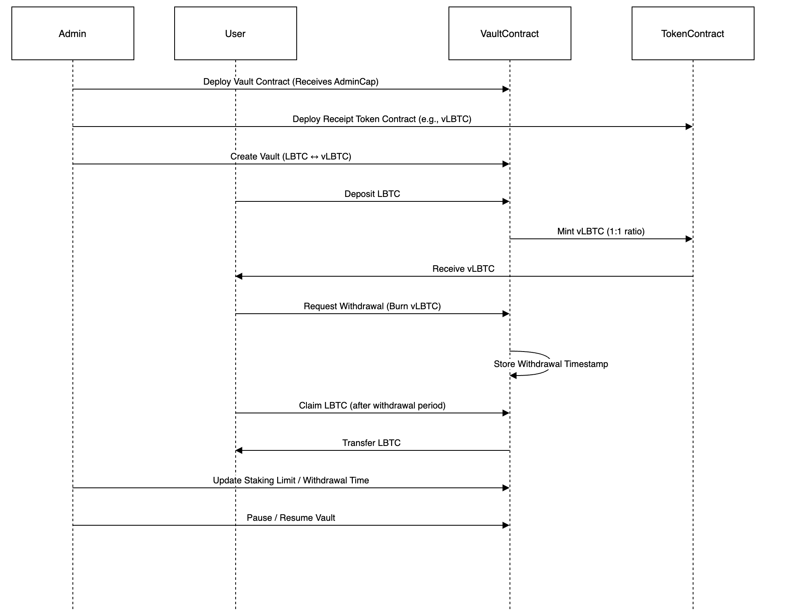

# Vault & Receipt Token System

## Overview

This system consists of two primary smart contracts:

1.**Vault Contract**: Manages deposits, withdrawal requests, and receipt token minting.

2.**Token Contract**: Implements a basic token representing receipt tokens issued upon deposits.

## Functionality

- The vault allows users to deposit a base token (e.g., LBTC) and receive a corresponding receipt token (e.g., vLBTC).
- Users can later request withdrawals, burn their receipt tokens, and retrieve their deposited assets after a specified withdrawal period.

## Flow Diagram



## System Flow

1.**Deployment**:

- Vault & receipt token contracts are deployed by the admin.
- Admin sets up vaults with token pairs.

2.**Deposit & Minting**:

- Users deposit tokens and receive receipt tokens.

3.**Withdrawal Process**:

- Users burn receipt tokens to initiate withdrawal.
- Users retrieve original tokens after the waiting period.

4.**Admin Controls**:

- Admin can set staking limits, pause vaults, and modify withdrawal times.
- New vaults can be created as needed.

## Installation and Deployment Guide

### Install SUI  
Follow the official SUI installation guide:  
[Getting Started with SUI](https://docs.sui.io/guides/developer/getting-started/sui-install)  

### Build the Contract  
Navigate to the `core` directory and build the contract using:  
```sh
sui move build
```

### Test the Contract  
Run the following command to test the contract:  
```sh
sui move test
```

### Deploy the Contract  

1. Navigate to the `core` directory and install dependencies:  
   ```sh
   npm install
   ```

2. Configure the `.env` file with your deployment credentials:  
   ```ini
   MNEMONICS=""
   NETWORK="testnet"  # Change to "mainnet" if deploying on mainnet
   ```

3. Deploy the Vault contract and an input token contract (e.g., LBTC) by running:  
   ```sh
   ts-node core/scripts/utils/setup.ts
   ```
   Necessary parameters will be updated in `core/scripts/utils/packageInfo.ts`.

4. Deploy the Receipt Token contract using the same process:  
   ```sh
   ts-node coin/scripts/utils/setup.ts
   ```

After deployment of receipt token, you will see the following output in the console:  
```json
{
  packageId: '0x90e1cb85b60c87f629eb3c1dbcea1ddfd0ab2c1093b10c15a1697146730f8b60',
  TreasuryCap: '0xf29dc8cb304a406ed528faee4b3e956d74f307975fee3ef9a219e1b162b816fd'
}
```
The `packageId` is the contract package ID, and the `TreasuryCap` is the treasury cap for the receipt token contract, which is used to mint receipt tokens.

NOTE: The `lbtc.move` module is intended solely for testing purposes from the scripts side and will be removed later.

For Example: To deploy a new vault, follow this process:

**For Coin: MBTC**
1. Deploy (for eg: MBTC) using coin/scripts/utils/newPublishAsset.ts, ensuring the respective CoinMetadata is updated.

2. This process will retrieve the type name and treasury cap of MBTC.

3. Update packageInfo.ts in core/scripts/utils/newPublishAsset with the retrieved values:

```typescript
export const CoinLBTCTreasuryCap = ''; // Replace with actual treasury cap 
export const COIN_A_TYPE = ''; // replace with actual mbtc typename
```

**For Coin: sat.mBTC**
1. Deploy (for eg: sat.mBTC) using coin/scripts/utils/newPublishAsset.ts, ensuring the respective CoinMetadata is updated.

2. This process will retrieve the type name and treasury cap of sat.mBTC.

3. Update packageInfo.ts in core/scripts/utils/newPublishAsset with the retrieved values:

```typescript
export const COIN_B_TYPE = '';  // Replace with actual type name  of sat.Mbtc
export const ReceiptTokenTreasuryCap = '';  // Replace with actual treasury cap sat.mbtc
```

Once the setup is complete, the address holding the AdminCap can perform the initialize vault function call.


5. Update `core/scripts/utils/packageInfo.ts` with the TreasuryCap value in `coin/scripts/utils/packageInfo.ts`:  
   ```ts
   export const ReceiptTokenTreasuryCap = '0xf29dc8cb304a406ed528faee4b3e956d74f307975fee3ef9a219e1b162b816fd';
   ```

6. Add `COIN_B_TYPE` in `core/scripts/utils/packageInfo.ts` from `coin/scripts/utils/packageInfo.ts` `TYPENAME` :  
   ```ts
   export const COIN_B_TYPE = '0x90e1cb85b60c87f629eb3c1dbcea1ddfd0ab2c1093b10c15a1697146730f8b60::template::TEMPLATE';
   ```
   This represents the coin type of the receipt token, using the `packageId` from the deployed coin contract.

### Finalizing Setup  

1. Create a Vault by running the script:  
   ```sh
   ts-node core/scripts/src/admin/initializeVault.ts
   ```

2. The Vault is initially paused. Start it by running:  
   ```sh
   ts-node core/scripts/src/admin/toggleVaultPause.ts
   ```

3. Mint Test Lbtc token by running: 
   ```sh
   ts-node core/scripts/src/mintLBTC.ts
   ```
   change respective recipient and mint_amount. it provides lbtc_coin_object_id which is necessary while depositing in vault.

4. Deposit LBTC and receive receipt tokens by calling:  
   ```sh
   ts-node core/scripts/src/depositFor.ts
   ```
   The script requires the following arguments:  
   ```ts
   arguments: [
       tx.object(Vault),
       tx.object('0xc12d8c856ed73d9974084024c7bc19d34c6ea36e70caa1ab65e3a4f00aaf7d8b'),
       tx.object(Version)
   ];
   ```
   - The second argument is a coin object representing the input token (LBTC in this case).